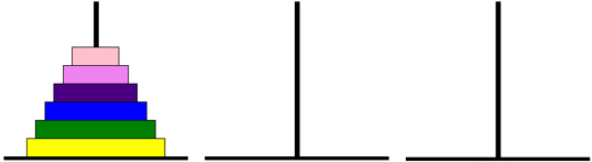
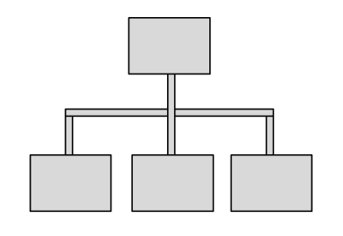
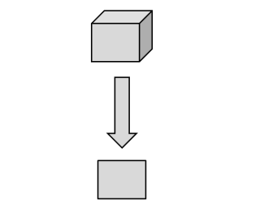
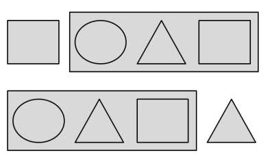
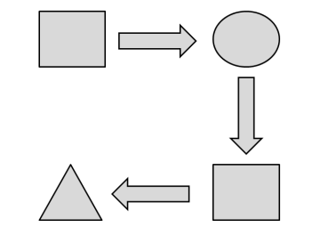
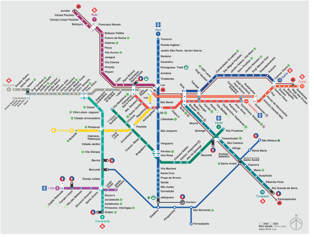
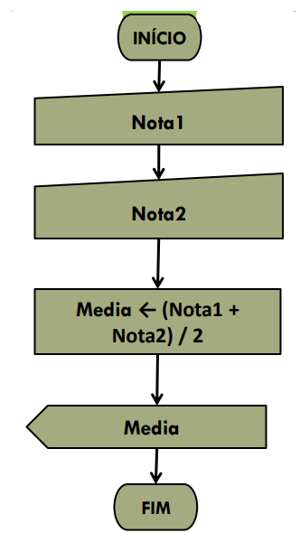

## Computacional Thinking

Seja bem-vindo à jornada do pensamento computacional!

Hoje, o pensamento computacional é visto não apenas como uma habilidade essencial para aqueles que trabalham em campos relacionados à tecnologia, mas também como uma habilidade valiosa para a resolução de problemas em diversas áreas. A capacidade analítica de compreender problemas e propor soluções sistêmicas é aplicável em muitas áreas, desde a ciência e engenharia até as artes e ciências sociais.


## Vamos jogar!

### O jogo

A ``Torre de Hanói`` é um dos mais famosos jogos de Matemática. Ele consiste de uma base contendo três pilares (hastes), em um dos quais está disposta uma torre formada por alguns discos colocados uns sobre os outros, em ordem crescente de diâmetro, de cima para baixo. O número de discos pode variar. Observe a disposição inicial de um jogo com seis discos.




### Desafio

Transferir todos os discos de um pino para outro qualquer. Tente transferi-los de um pino para outro em
apenas 31 movimentos, sendo que você poderá mover apenas um disco por vez.

### Regras

!!! warning
    Um disco maior nunca poderá ficar em cima de um disco menor.

### Jogar

Desenvolva uma estratégia para conseguir solucionar com a menor quantidade de movimentos. 

<iframe title="Torre de Hanoi" src="https://www.geogebra.org/material/iframe/id/ebnrujnm/width/755/height/415/border/ffffff/sfsb/false/smb/false/stb/false/stbh/false/ai/false/asb/false/sri/false/rc/false/ld/false/sdz/false/ctl/false" width="760px" height="420px" style="border: 2px solid #008000;"> </iframe>

>> Se o jogo não abrir acesse o link: [https://www.geogebra.org/m/s5hd5qum](https://www.geogebra.org/m/s5hd5qum)


!!! progress
    Continuar...

## O que é pensamento computacional?

O pensamento computacional é uma forma de abordar problemas e sistemas de uma maneira que um computador poderia entender. Não se trata apenas de programar, mas sim de uma mentalidade que utiliza conceitos fundamentais da ciência da computação para resolver problemas, projetar sistemas e compreender o comportamento humano. Então não relacione pensamento computacional a computador, não necessariamente são utilizados computadores nesse processo. A ideia central é trazer a forma de raciocínio que as máquinas aplicam nos problemas. 

!!! warning
    Pensamento computacional não depende computadores e nem de linguagem computacional, logo não se resume a programação ou software ou internet...

## Quais são os 4 pilares do pensamento computacional?

Para que o pensamento computacional seja aplicado, vamos conhecer os seus 4 pilares. 


### 1. Decomposição
- **Definição**: Dividir um problema complexo em partes menores e mais gerenciáveis.
- **Por que é importante?**: Ao decompor um problema, podemos focar em solucionar cada parte individualmente, tornando a tarefa global mais simples.
- **Exemplo**: Ao criar um website, podemos decompor o projeto em partes como design, funcionalidades, conteúdo e otimização para dispositivos móveis.




### 2. Abstração
- **Definição**: Focar nas informações essenciais de um problema, ignorando detalhes desnecessários.
- **Por que é importante?**: Ajuda a simplificar problemas complexos, permitindo que nos concentremos nos aspectos mais cruciais.
- **Exemplo**: Ao desenvolver um aplicativo de transporte, não precisamos saber como um carro funciona internamente, mas sim como ele se move de um ponto a outro.




### 3. Reconhecimento de Padrões
- **Definição**: Identificar semelhanças ou tendências em problemas ou conjuntos de dados.
- **Por que é importante?**: Reconhecer padrões nos permite fazer previsões e identificar soluções mais rapidamente.
- **Exemplo**: Ao analisar dados de vendas, podemos identificar em quais meses as vendas aumentam e planejar estratégias de marketing com base nisso.




### 4. Algoritmo
- **Definição**: Criar uma série de instruções passo a passo para resolver um problema ou realizar uma tarefa.
- **Por que é importante?**: Os algoritmos garantem que uma tarefa seja realizada de forma eficiente e correta.
- **Exemplo**: Ao preparar uma receita, seguimos um algoritmo para garantir que o prato seja feito corretamente.




## Como desenvolver o Pensamento Computacional?

Desenvolver o pensamento computacional requer prática e imersão. Durante este curso, usaremos Python, uma linguagem de programação poderosa e versátil, como nossa ferramenta principal. Através de exercícios práticos, projetos e discussões em sala de aula, você será desafiado a aplicar os conceitos de pensamento computacional para resolver problemas reais. Encorajamos a colaboração, a experimentação e, acima de tudo, a curiosidade. 


!!! progress
    Continuar...

## Desafios

!!! exercise choice "Question"
    Assinale o que você entende sobre Decomposição:
    
    - [ ] Analisar o problema e aumentar partes
    - [x] Conhecer o problema e dividir em partes menores
    - [ ] Apagar partes de um programa
    - [ ] Testar um Algoritmos

    !!! answer
        Dividir para conquistar.


!!! exercise choice "Question"
    Assinale o que você entende sobre Reconhecimento de Padrões

    - [x] Identificar situações que se repetem dentro do problema ou entre problemas
    - [ ] Reconhecer um erro em um programa
    - [ ] Identificar o que há de diferente em um problema
    - [ ] Reconhecer o final de um problema

    !!! answer
        .


!!! exercise choice "Question"
    Assinale o que você entende sobre Abstração

    - [ ] É pensar sobre o que vem antes do problema
    - [x] Escolher o que é o mais importante para resolver um problema
    - [ ] Escolher o que é o menos destacado no problema
    - [ ] É pensar sobre como deveria ser o problema

    !!! answer
        .


!!! exercise choice "Question"
    Assinale o que você entende sobre Algoritmo

    - [ ] Organizar um passo a passo que não deve ser testado na solução do problema
    - [x] Organizar os passos para a solução de um problema e testar
    - [ ] Listar as ações que o problema não apresentou
    - [ ] Organizar a escrita do problema

    !!! answer
        .


!!! exercise choice "Question"
    Podemos relacionar o mapa do metro de SP com qual pilar do pensamento computacional?
    
    
    - [x] Abstração
    - [ ] Reconhecimento de Padrões
    - [ ] Decomposição
    - [ ] Algoritmo

    !!! answer
        O mapa do metrô como exemplo de abstração do mundo real    


!!! progress
    Continuar...

## Representação de algoritimos 

!!! tip
    Um algoritmo é, de fato, uma sequência definida de passos ou instruções para resolver um problema ou realizar uma tarefa. Ele serve como um "plano" ou "receita" para uma solução. Um algoritmo não é, por si só, um programa de computador. No entanto, um programa de computador pode ser desenvolvido com base em um ou mais algoritmos. Podemos representar algoritmos por meio de pseudocódigos ou fluxogramas.


### Pseudocódigo
 É uma descrição de alto nível de um algoritmo que usa a estrutura de um programa de computador, mas pode ser lido por humanos. Ele não é escrito em uma linguagem de programação específica, mas sim em uma forma que pode ser facilmente convertida em código real.

```shell

    Algoritmo CalcularMedia
       // Entrada de dados
       Ler num1
       Ler num2
       Ler num3
       
       // Cálculo da média
       media <- (num1 + num2 + num3) / 3
       
       // Saída de dados
       Escrever "A média é: ", media
    FimAlgoritmo

```


### Fluxograma
 É uma representação gráfica de um algoritmo. Usa símbolos padrão (como retângulos, losangos e ovais) conectados por setas para representar os passos e o fluxo de um algoritmo.



!!! tip
    O objetivo de desenvolvidores de sistemas e profissionais de tecnologia é encontrar algoritimos mais eficientes para resolução do problema.


!!! exercise choice "Question"
    Assinale a definição correta de um algoritmo:
    
    - [ ] Uma linguagem de programação específica.
    - [x] Uma sequência definida de passos ou instruções para resolver um problema ou realizar uma tarefa.
    - [ ] Um programa de computador.
    - [ ] Uma representação gráfica de um programa.

    !!! answer
        Um algoritmo é uma sequência definida de passos ou instruções para resolver um problema ou realizar uma tarefa.

!!! exercise choice "Question"
    O que é pseudocódigo?
    
    - [ ] Um código escrito em uma linguagem de programação específica.
    - [x] Uma descrição de alto nível de um algoritmo que pode ser lido por humanos.
    - [ ] Um tipo de fluxograma.
    - [ ] Um programa de computador.

    !!! answer
        Pseudocódigo é uma descrição de alto nível de um algoritmo que pode ser lido por humanos.

!!! exercise choice "Question"
    Qual é o objetivo dos desenvolvedores de sistemas e profissionais de tecnologia ao trabalhar com algoritmos?
    
    - [ ] Criar fluxogramas.
    - [ ] Escrever pseudocódigos.
    - [x] Encontrar algoritmos mais eficientes para a resolução do problema.
    - [ ] Aumentar a complexidade do problema.

    !!! answer
        O objetivo é encontrar algoritmos mais eficientes para a resolução do problema.

!!! exercise choice "Question"
    Imagine que você foi contratado para desenvolver um algoritmo que calcule o desconto em uma compra. O desconto é de 10% se o valor da compra for maior que R$100. Dentre os pseudocódigos abaixo, qual deles implementa corretamente essa lógica?

    - [x] DescontoA
            ```shell
            Algoritmo DescontoA
                Ler valorCompra
                Se valorCompra > 100 Então
                    desconto <- valorCompra * 0.10
                Senão
                    desconto <- 0
                FimSe
                Escrever "Desconto: ", desconto
            FimAlgoritmo
            ```
    - [ ] DescontoB
            ```shell
            Algoritmo DescontoB
               Ler valorCompra
               Se valorCompra < 100 Então
                   desconto <- valorCompra * 0.10
               Senão
                   desconto <- 0
               FimSe
               Escrever "Desconto: ", desconto
            FimAlgoritmo
            ```         
    - [ ] DescontoC
            ```shell
            Algoritmo DescontoC
               Ler valorCompra
               desconto <- valorCompra * 0.10
               Escrever "Desconto: ", desconto
            FimAlgoritmo
            ```
    - [ ] DescontoD
            ```shell
            Algoritmo DescontoD
               Ler valorCompra
               Se valorCompra > 100 Então
                   desconto <- 0
               Senão
                   desconto <- valorCompra * 0.10
               FimSe
               Escrever "Desconto: ", desconto
            FimAlgoritmo
            ```
 
    !!! answer
        O pseudocódigo DescontoA implementa corretamente a lógica de dar 10% de desconto se o valor da compra for maior que R$100.

!!! exercise choice "Question"
    Você foi solicitado a criar um algoritmo para calcular juros simples. O juro simples é calculado pela fórmula J = P * i * n, onde $P$ é o Capital, $i$ é a taxa de juro e $n$ é o número de períodos. Qual dos pseudocódigos abaixo implementa corretamente essa lógica?

    - [x] JuroSimplesA
            ```shell
            Algoritmo JuroSimplesA
                Ler P, i, n
                J <- P * i * n
                Escrever "Juros: ", J
            FimAlgoritmo
            ```
    - [ ] JuroSimplesB
            ```shell
            Algoritmo JuroSimplesB
                Ler P, i, n
                J <- P + i + n
                Escrever "Juros: ", J
            FimAlgoritmo
            ```         
    - [ ] JuroSimplesC
            ```shell
            Algoritmo JuroSimplesC
                Ler P, i, n
                J <- P * i / n
                Escrever "Juros: ", J
            FimAlgoritmo
            ```
    - [ ] JuroSimplesD
            ```shell
            Algoritmo JuroSimplesD
                Ler P, i
                J <- P * i
                Escrever "Juros: ", J
            FimAlgoritmo
            ```

    !!! answer
        O pseudocódigo JuroSimplesA implementa corretamente a fórmula para calcular juros simples.

!!! exercise choice "Question"
    Seu objetivo é desenvolver um algoritmo que verifique se um número é par. Qual dos pseudocódigos abaixo implementa corretamente essa verificação?

    - [ ] ParOuImparA
            ```shell
            Algoritmo ParOuImparA
                Ler num
                Se num / 2 = 1 Então
                    Escrever "Par"
                Senão
                    Escrever "Ímpar"
                FimSe
            FimAlgoritmo
            ```
    - [x] ParOuImparB
            ```shell
            Algoritmo ParOuImparB
                Ler num
                Se num MOD 2 = 0 Então
                    Escrever "Par"
                Senão
                    Escrever "Ímpar"
                FimSe
            FimAlgoritmo
            ```         
    - [ ] ParOuImparC
            ```shell
            Algoritmo ParOuImparC
                Ler num
                Se num MOD 2 = 1 Então
                    Escrever "Par"
                Senão
                    Escrever "Ímpar"
                FimSe
            FimAlgoritmo
            ```
    - [ ] ParOuImparD
            ```shell
            Algoritmo ParOuImparD
                Ler num
                Se num / 2 = 0 Então
                    Escrever "Par"
                Senão
                    Escrever "Ímpar"
                FimSe
            FimAlgoritmo
            ```

    !!! answer
        O pseudocódigo ParOuImparB verifica corretamente se um número é par ou ímpar.


!!! progress
    Continuar...


## O que é um computador?

O dicionario talvez defina o termo computador como um “dispositivo eletrônico que é capaz de receber informações (dados) de uma forma particular e de realizar uma sequência de operações [...] para produzir um resultado”. No entanto, a definição original do mesmo termo, em uso do século XVII, é ligeiramente diferente. Refere-se a alguém “que computa” ou uma “pessoa que realiza cálculos matemáticos” – da Wikipedia.
Quando usamos o termo ``computador``, consideramos sempre a definição mais genérica: qualquer agente processador de informação (ou seja, uma máquina ou uma pessoa agindo mecanicamente se devidamente instruído) que pode fazer cálculos e produzir alguma saída a partir de informações de entrada.


Eniac - um marco na computação.

!!! tip
    Para saber mais sobre a história da computação:

    - [https://www.cos.ufrj.br/semana/2019/slides/Jayme_Semana_PESC_2019.pdf](https://www.cos.ufrj.br/semana/2019/slides/Jayme_Semana_PESC_2019.pdf)
    - [https://www.ime.usp.br/~macmulti/historico/](https://www.ime.usp.br/~macmulti/historico/)

### Como um computador computa?

O processo de computação envolve a execução de instruções específicas em uma sequência determinada. Estas instruções são fornecidas ao computador na forma de programas. Quando um programa é executado, ele passa por várias etapas:

- Entrada: O computador recebe dados, seja por meio de um teclado, mouse, sensores ou outros dispositivos.
- Processamento: A CPU (Unidade Central de Processamento) processa os dados, executando operações aritméticas e lógicas.
- Armazenamento: Os dados processados podem ser armazenados na memória do computador ou em dispositivos de armazenamento, como discos rígidos.
- Saída: O computador exibe ou transmite os resultados do processamento, seja em um monitor, impressora ou através de sinais para outros dispositivos.

### Linguagens naturais vs linguagens de programação

``Linguagens naturais`` são as línguas que as pessoas falam, como inglês, português ou mandarim. Elas evoluíram naturalmente ao longo do tempo e são ricas em nuances, ambiguidades e contextos culturais.

``Linguagens de programação``, pelo contrário, são línguas de origem formal. Obrigam a regras sintáticas específicas. Tais regras evitam possíveis afirmações ambíguas, principalmente por restringir a expressividade da linguagem. Portanto, todas as sentenças em tal linguagem estão transmitindo apenas um significado possível.

Em particular, podemos distinguir três macroconjuntos de linguagens de programação:

- ``linguagem de máquina`` é um conjunto de instruções que podem ser executadas diretamente pela unidade central de processamento (CPU) de um computador eletrônico. Por exemplo, o código a seguir é o código executável binário (ou seja, uma sequência de 0 e 1) definindo uma função (ou seja, um tipo de ferramenta que recebe algumas entradas e produz algumas saídas) para calcular o n-ésimo número de Fibonacci:
   
```asm
100010110101010000100100000010001000001111111010000000000111011
100000110101110000000000000000000000000000000000011000011100000
111111101000000010011101110000011010111000000000010000000000000
000000000001100001101010011101110110000000100000000000000000000
000010111001000000010000000000000000000000001000110100000100000
110011000001111111010000000110111011000000111100010111101100110
001001110000010100101011101011111100010101101111000011
```

- ``linguagem de baixo nivel`` são linguagens que fornecem um nível de abstração acima da linguagem de máquina. Desta forma, permite escrever programas de uma forma mais inteligível para os humanos. A linguagem mais popular desse tipo é Assembly (ASM). Mesmo que introduzindo símbolos humanamente reconhecíveis, uma linha de código assembly normalmente representa uma instrução de máquina em linguagem de máquina. Por exemplo, a mesma função para calcular o n-ésimo número de Fibonacci é definida em Assembly da seguinte forma:
    
```ASM
   fib:
      mov edx, [esp+8]
      cmp edx, 0
      ja @f
      mov eax, 0
      ret

      @@:
      cmp edx, 2
      ja @f
      mov eax, 1
      ret

      @@:
      push ebx
      mov ebx, 1
      mov ecx, 1

      @@:
            lea eax, [ebx+ecx]
            cmp edx, 3
            jbe @f
            mov ebx, ecx
            mov ecx, eax
            dec edx
      jmp @b

      @@:
      pop ebx
      ret
```

- ``linguagem de alto nivel`` são caracterizados por uma forte abstração da especificabilidade da linguagem de máquina. Em particular, pode usar palavras de linguagem natural para construções específicas para serem fáceis de usar e entender por humanos. De um modo geral, quanto mais abstração das linguagens de programação de baixo nível for fornecida, mais compreensível será a linguagem. Por exemplo, no exemplo a seguir, mostramos como usar a linguagem de programação C para implementar a mesma função de antes:
    
```C
    unsigned int fib(unsigned int n) {
       if (n <= 0)
          return 0;
       else if (n <= 2)
          return 1;
       else {
          unsigned int a,b,c;
          a = 1;
          b = 1;
          while (1) {
                c = a + b;
                if (n <= 3) return c;
                a = b;
                b = c;
                n--;
          }
       }
    }

```

!!! exercise choice two-cols
    Quais são linguagens de alto nível? existe mais de uma alternativa correta.
    
    - [x] Java.
    - [x] JavaScript.
    - [x] Ruby.
    - [x] Python.
    - [x] C#.
    - [x] PHP.
    - [ ] Assembly.
    - [x] Swift.
    - [x] Kotlin.
    - [x] Go.
    - [x] Perl.
    - [x] Lua.
    - [x] R.
    - [x] TypeScript.
    - [x] Rust.
    - [x] Scala.
    - [x] Groovy.
    - [x] MATLAB.
    - [x] C++.
    - [x] Elixir.
    - [x] C.
    - [ ] VHDL.

    !!! answer
        As linguagens de alto nível são: Java, JavaScript, Ruby, Python, C#, PHP, Swift, Kotlin, Go, Perl, Lua, R, TypeScript, Rust, Scala, Groovy e MATLAB. Assembly e VHDL são linguagens de baixo nível.


