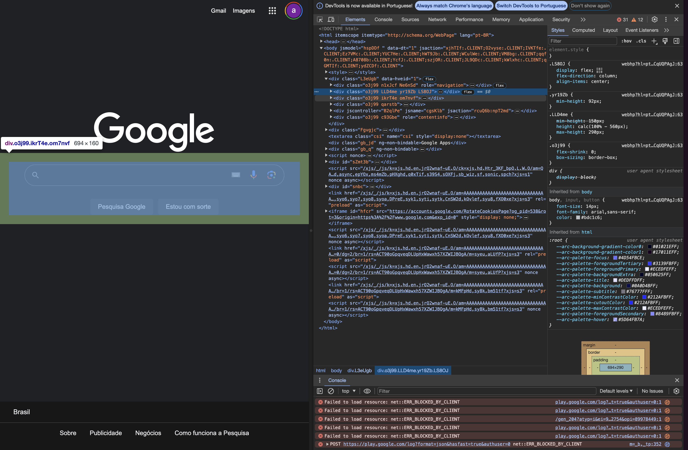

## Introdução ao Web Scraping

`Web scraping` é uma técnica utilizada para `extração, cópia, triagem ou coleta de dados de websites`. Ela envolve fazer requisições a um servidor web para obter o conteúdo de uma página e, em seguida, extrair informações específicas dessa página. 
A cada dia vemos mais serviços sendo baseados na Web, isso faz com que exista uma procura crescente de dados brutos. Os dados são um requisito básico nas áreas de `ciência e tecnologia` e `gestão`. Os dados coletados são processados, analisados, comparados com dados históricos e treinados usando técnicas de `Machine Learning` (ML) para obter estimativas, informações e adquirir mais conhecimento.


### Por que usar Web Scraping?

O web scraping pode ser usado por várias razões, incluindo:

- Coletar dados para análise de mercado ou pesquisa.
- Monitorar preços de produtos em diferentes sites para comparação.
- Extrair informações de contato de empresas para fins de marketing.
- Agregar conteúdo de diferentes fontes para um site ou aplicativo.
- Automatizar a coleta de dados para relatórios regulares.


### Considerações Éticas e Legais

Existem alguns fatores legais que também devem ser considerados antes de executar tarefas de scraping. A maioria dos sites contém páginas como `Política de Privacidade`, `Sobre Nós` e `Termos e Condições`, onde estão disponíveis informações sobre ações legais e conteúdo proibido, bem como informações gerais. É dever ético do desenvolvedor cumprir estes termos e condições antes de planejar qualquer atividade de scraping em um site. 

Ao fazer web scraping, é importante considerar questões éticas e legais:

- Respeite os Termos de Uso: Muitos sites têm termos de uso que proíbem explicitamente o web scraping. É importante ler e respeitar esses termos antes de extrair dados.
- Não sobrecarregue o servidor: Fazer muitas requisições em um curto período de tempo pode sobrecarregar o servidor do site. É uma boa prática limitar a frequência das requisições para não afetar negativamente o desempenho do site.
- Proteção de Dados: Esteja ciente das leis de proteção de dados, como o GDPR na Europa, que impõem restrições sobre a coleta e o uso de dados pessoais.


## Protocolo HTTP

O protocolo HTTP (Hypertext Transfer Protocol) é o fundamento da comunicação de dados na web. Ele define um conjunto de regras para a transferência de arquivos (textos, imagens, som, vídeo e outros dados) na internet.

 O HTTP é um protocolo baseado em solicitação-resposta, onde o cliente envia uma solicitação ao servidor e espera uma resposta.

 

### Requisição HTTP (Request)

Uma requisição HTTP é uma mensagem enviada pelo cliente ao servidor solicitando uma ação, como obter um recurso (uma página web, por exemplo) ou enviar dados (como em um formulário). Uma requisição HTTP consiste em:

- `Método`: Indica a ação desejada (GET, POST, PUT, DELETE, etc.). O método GET é usado para solicitar um recurso, enquanto o POST é usado para enviar dados ao servidor.
- `URL`: O endereço do recurso no servidor.
- `Cabeçalhos`: Fornecem informações adicionais sobre a requisição, como o tipo de conteúdo esperado na resposta.
- `Corpo`: Opcionalmente, contém dados enviados ao servidor (principalmente usado com o método POST).

### Resposta HTTP (Response)

Uma resposta HTTP é a mensagem enviada pelo servidor ao cliente em resposta a uma requisição. Ela contém:

- `Código de Status`: Um número de três dígitos que indica o resultado da requisição. Por exemplo, 200 significa sucesso, 404 indica que o recurso não foi encontrado, e 500 indica um erro interno do servidor.
- `Cabeçalhos`: Informações sobre a resposta, como o tipo de conteúdo e a data de criação.
- `Corpo`: O conteúdo do recurso solicitado, como o HTML de uma página web.###

!!! tip
    Os `códigos de status HTTP` são números de três dígitos que indicam o resultado de uma requisição HTTP. Eles são divididos em cinco categorias:

    - `1xx: Informacional`
        - 100 Continue: Indica que o servidor recebeu os cabeçalhos da requisição e o cliente deve continuar enviando o corpo da requisição.
    - `2xx: Sucesso`
        - 200 OK: A requisição foi bem-sucedida e o servidor retorna o recurso solicitado.
        - 201 Created: Um recurso foi criado com sucesso no servidor (por exemplo, após uma requisição POST).
        - 204 No Content: A requisição foi bem-sucedida, mas o servidor não tem conteúdo para enviar na resposta.
    - `3xx: Redirecionamento`
        - 301 Moved Permanently: O recurso solicitado foi movido permanentemente para uma nova URL.
        - 302 Found: O recurso solicitado foi temporariamente movido para uma nova URL.
        - 304 Not Modified: O recurso solicitado não foi modificado desde a última requisição.
    - `4xx: Erro do Cliente`
        - 400 Bad Request: A requisição não pode ser processada pelo servidor devido a um erro de sintaxe.
        - 401 Unauthorized: A autenticação é necessária para acessar o recurso solicitado.
        - 403 Forbidden: O servidor entende a requisição, mas se recusa a autorizá-la.
        - 404 Not Found: O recurso solicitado não foi encontrado no servidor.
        - 429 Too Many Requests: O cliente enviou muitas requisições em um determinado período de tempo.
    - `5xx: Erro do Servidor`
        - 500 Internal Server Error: Ocorreu um erro genérico no servidor.
        - 501 Not Implemented: O servidor não suporta a funcionalidade necessária para atender à requisição.
        - 503 Service Unavailable: O servidor está temporariamente indisponível, geralmente devido a manutenção ou sobrecarga.

## HTML

`HTML` (HyperText Markup Language) é a linguagem de marcação usada para estruturar e apresentar conteúdo na web. Ela define a estrutura de uma página web usando uma série de elementos, representados por `tags`. Cada tag tem um propósito específico e define uma parte do conteúdo ou da estrutura da página.

### Tags Comuns no HTML

Aqui estão algumas das `tags HTML mais comumente encontradas` e que são frequentemente alvo no web scraping:

- `<html>`: O elemento raiz que contém todo o conteúdo da página.
- `<head>`: Contém metadados, links para folhas de estilo e scripts.
- `<title>`: Define o título da página, que é exibido na aba do navegador.
- `<body>`: Contém o conteúdo principal da página, como texto, imagens e links.
- `<h1>`, `<h2>`, ..., `<h6>`: Tags de cabeçalho, usadas para títulos e subtítulos. `<h1>` é o mais importante e `<h6>` é o menos importante.
- `<p>`: Define um parágrafo de texto.
- `<a>`: Define um hiperlink. O atributo `href` especifica o URL do link.
- `<ul>`, `<ol>`, `<li>`: Criam listas não ordenadas (com marcadores) e ordenadas (numeradas), respectivamente. `<li>` define um item da lista.
- `<div>`: Um contêiner genérico para agrupar conteúdo e aplicar estilos.
- `<span>`: Similar ao `<div>`, mas usado para agrupar elementos inline.
- `<table>`, `<tr>`, `<th>`, `<td>`: Estruturam tabelas. `<table>` define a tabela, `<tr>` uma linha, `<th>` uma célula de cabeçalho e `<td>` uma célula de dados.
- ``: Incorpora uma imagem. O atributo `src` especifica o caminho da imagem.

### Estrutura Básica do HTML

Um documento HTML típico tem a seguinte estrutura:

```html
<!DOCTYPE html>
<html>
<head>
    <title>Título da Página</title>
</head>
<body>
    <h1>Cabeçalho Principal</h1>
    <p>Este é um parágrafo de exemplo.</p>
    <a href="https://exemplo.com">Link para Exemplo</a>
</body>
</html>
```

- `<!DOCTYPE html>`: Declara o tipo do documento (neste caso, HTML5).
- `<html>`: Elemento raiz que envolve todo o conteúdo da página.
- `<head>`: Contém metadados e links para recursos externos (como CSS).
- `<title>`: Define o título da página, que é exibido na aba do navegador.
- `<body>`: Contém o conteúdo principal da página, como texto, imagens e links.

### Seletores HTML

Para fazer web scraping, é essencial entender como selecionar elementos específicos do HTML. Os seletores mais comuns incluem:

- `Seletores de Tag`: Selecionam elementos pelo nome da tag, como `p` para parágrafos ou `a` para links.
- `Seletores de ID`: Selecionam um elemento único com um ID específico, usando o símbolo `#`. Por exemplo, `#meu-id` seleciona o elemento com `id="meu-id"`.
- `Seletores de Classe`: Selecionam todos os elementos com uma classe específica, usando o ponto `.`. Por exemplo, `.minha-classe` seleciona todos os elementos com `class="minha-classe"`.


## Ferramentas do Desenvolvedor e Web Scraping

Navegadores web são utilizados para interação gráfica cliente-servidor para explorar conteúdos da web. A barra de endereços do navegador é fornecida com o endereço web ou URL, a URL solicitada é comunicada ao servidor (host), e uma resposta é recebida, o que significa que é carregada pelo navegador. Esta resposta obtida ou fonte da página pode ser explorada e pesquisada em formato bruto para encontrar o conteúdo desejado.

!!! tip
    Você é livre para escolher qual navegador web deseja usar. A maioria dos navegadores web exibirá o mesmo conteúdo ou conteúdo similar.

As Ferramentas do Desenvolvedor (DevTools) são recursos integrados na maioria dos navegadores modernos que desempenham um papel fundamental no desenvolvimento web e no web scraping. Elas permitem que desenvolvedores e analistas de dados inspecionem, editem e depurem o HTML, CSS e JavaScript de uma página, além de oferecerem funcionalidades para monitorar o desempenho e analisar as requisições e respostas HTTP.

### Acessando o DevTools

Para acessar o DevTools, você pode usar o menu principal do navegador ou atalhos de teclado:

- No Google Chrome e no Firefox, você pode abrir o DevTools clicando com o botão direito em qualquer parte da página e selecionando "Inspecionar" ou pressionando `Ctrl + Shift + I` (ou `Cmd + Opt + I` no macOS).
- Outra opção é acessar o menu do navegador, selecionar "Mais ferramentas" ou "Ferramentas do desenvolvedor" e clicar em "Ferramentas do desenvolvedor".

### Exemplo

1. Abra [https://www.google.com](https://www.google.com) no seu navegador web (ou qualquer outra URL).
2. Após a página ser carregada completamente, clique com o botão direito em qualquer seção da página. Deve aparecer a opção "Inspecionar".


### Utilizando o DevTools para Web Scraping

O DevTools é especialmente útil para web scraping, pois permite que você:




- **Visualize a Estrutura da Página**: Na aba "Elementos" (ou "Inspector" no Firefox), você pode visualizar a árvore DOM da página, o que é útil para entender a estrutura do HTML e identificar os seletores necessários para extrair dados.
- **Analise Requisições e Respostas HTTP**: Na aba "Rede", você pode ver todas as requisições e respostas HTTP feitas pela página, incluindo detalhes como o método HTTP, código de status, cabeçalhos e corpo da resposta. Isso é crucial para entender como os dados são carregados e como você pode simular requisições no seu script de scraping.
- **Teste e Depure JavaScript**: A aba "Console" permite executar código JavaScript diretamente no navegador, o que pode ser útil para testar snippets de código que você planeja usar no seu script de scraping.

### Dicas Importantes

- Se você está procurando por conteúdo específico na fonte da página ou nos recursos carregados, utilize os campos de pesquisa e filtro disponíveis no DevTools para localizar rapidamente o que você precisa.
- Ao inspecionar elementos ou analisar requisições de rede, esteja atento a dados dinâmicos ou conteúdo carregado via JavaScript, pois eles podem não estar imediatamente visíveis na fonte HTML estática da página.
