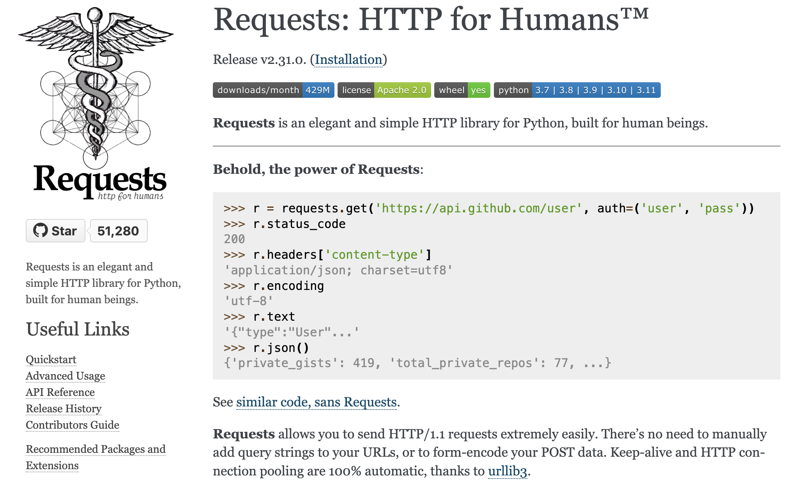

## Acessando a WWW com Python

Existem várias bibliotecas em Python para interagir com o HTTP. `requests` e `urllib` são as duas bibliotecas que nos interessam por causa de seus recursos aprofundados, várias funções para lidar com comunicação HTTP, documentação de fácil leitura e popularidade.

Para começar a acessar a `WWW` com Python usando essas bibliotecas, vamos verificar se temos todos os recursos necessários instalados. Ccomeçaremos a configurar as coisas, `criar um ambiente virtual`, `instalar bibliotecas no ambiente criado` e `acessar a web usando bibliotecas Python`.

### Biblioteca Requests

A biblioteca requests é uma das ferramentas mais populares em Python para realizar requisições HTTP de forma simples e intuitiva. Vamos explorar os conceitos básicos e como realizar as principais operações`HTTP com requests`.



### Instalação

Caso seja necessário é possivel realizar a instalação usando o gerenciador de pacotes do python, `pip`.

```bash
pip install requests
```


!!! progress
    Continuar...


### Métodos HTTP com requests

Os `métodos HTTP` são os verbos que indicam a ação que você deseja realizar em um recurso na web. Os mais comuns são:

- `GET`: Solicita a representação de um recurso.
- `POST`: Envia dados para serem processados por um recurso.
- `PUT`: Atualiza um recurso existente ou cria um novo se não existir.
- `DELETE`: Remove um recurso.

### Realizando uma `Requisição GET`

Uma requisição `GET` é usada para solicitar dados de um recurso específico. Com requests, você pode realizar uma requisição GET da seguinte maneira:

```python
import requests

response = requests.get('https://requests.readthedocs.io/')
print(response.text)
```

### Parâmetros de URL

É comum enviar parâmetros na URL de uma requisição GET. Com requests, você pode passar esses parâmetros como um dicionário:

```python
import requests

# Definindo os parâmetros da consulta
params = {'userId': 1}

# Enviando uma requisição GET para a API
response = requests.get('https://jsonplaceholder.typicode.com/posts', params=params)

# Imprimindo a URL com os parâmetros de consulta
print(response.url)

# Imprimindo o conteúdo da resposta (os primeiros 5 posts do usuário com ID 1)
print(response.json())

```

### Cabeçalhos

abeçalhos HTTP são usados para fornecer informações adicionais sobre a requisição ou a resposta. Eles podem incluir detalhes como o tipo de conteúdo esperado, o agente do usuário (User-Agent), informações de autenticação, entre outros. Com a biblioteca requests, você pode personalizar os cabeçalhos da sua requisição de maneira simples.

#### Adicionando Cabeçalhos à Requisição

Para adicionar cabeçalhos à sua requisição, você pode passar um dicionário contendo os cabeçalhos desejados para o parâmetro headers da função de requisição. Veja um exemplo:

```python
import requests

# Definindo o cabeçalho da requisição
headers = {
    'User-Agent': 'MeuApp/1.0',
    'Accept': 'application/json'
}

# Enviando uma requisição GET para a API
response = requests.get('https://jsonplaceholder.typicode.com/posts/1', headers=headers)

# Imprimindo o conteúdo da resposta
print(response.json())

```

Neste exemplo, estamos enviando três cabeçalhos: `User-Agent`, `Accept`. O User-Agent identifica o cliente que está fazendo a requisição, o Accept indica o tipo de conteúdo que o cliente espera receber. Existem outros parametros que podem ser utilizados.

#### Acessando o Conteúdo da Resposta

O conteúdo da resposta pode ser acessado de várias formas, dependendo do tipo de dados esperados:

- `Texto`: Para obter o conteúdo da resposta como uma string, você pode usar o atributo `.text`.
- `Bytes`: Se você precisa do conteúdo bruto da resposta em bytes, pode usar o atributo `.content`.
- `JSON`: Para respostas que retornam dados em formato JSON, você pode usar o método `.json()` para decodificar automaticamente o JSON para um objeto Python (geralmente um dicionário ou uma lista).

```python
import requests

response = requests.get('https://www.uol.com')

print(response.url)
print("")
print(response.text)
print("")
print(response.content)
```


A resposta de uma requisição HTTP também contém cabeçalhos. Com a biblioteca requests, você pode acessar os cabeçalhos da resposta através do atributo .headers do objeto de resposta. Os cabeçalhos da resposta são retornados como um dicionário:

```python
import requests

response = requests.get('https://www.uol.com')
print(response.headers)

```
Você pode acessar um cabeçalho específico da resposta da mesma forma que acessaria um valor em um dicionário:

```python
content_type = response.headers['Content-Type']
print(content_type)
```

#### Status Code e Verificação de Erros

O `status code` da resposta indica o resultado da requisição HTTP. Você pode acessar o status code através do atributo `.status_code` do objeto de resposta:

```python
import requests

response = requests.get('https://www.uol.com')
print(response.status_code)
```

É uma boa prática `verificar` se a requisição foi `bem-sucedida` antes de tentar acessar o conteúdo da resposta. Você pode fazer isso verificando se o status code está na faixa de sucesso (200-299):

```python
if response.status_code == 200:
    print("Requisição bem-sucedida!")
    # Processar a resposta
else:
    print("Erro na requisição:", response.status_code)
```


!!! exercise "Questão 1"
    Utilize a biblioteca `requests` para fazer uma requisição GET ao seguinte endpoint da API de Chuck Norris e exiba a piada recebida:

    - Endpoint: `https://api.chucknorris.io/jokes/random`

    - Dica: acesse o endpoint diretamente pelo browser e avalie a estrutura da resposta, verifique se é json ou html a resposta. Nesta estrutura onde está a piada?
    

    !!! answer
        Para resolver esta questão, você pode usar o seguinte código:

        ```python
        import requests

        response = requests.get("https://api.chucknorris.io/jokes/random")
        piada = response.json()['value']
        print("Piada:", piada)
        ```


!!! exercise "Questão 2"
    Crie uma função em Python que utilize a biblioteca `requests` para buscar informações sobre um Pokémon específico na PokéAPI. A função deve receber o nome do Pokémon como argumento e retornar sua altura e peso.

    - Exemplo de endpoint: `https://pokeapi.co/api/v2/pokemon/pikachu`

    - Dica: nesse exemplo, `pikachu` é o nome do pokemon e deve ser um parametro da função que será substituido quando a função for chamada.

    !!! answer
        Uma possível solução para esta questão é a seguinte:

        ```python
        import requests

        def get_pokemon_info(nome):
            url = f"https://pokeapi.co/api/v2/pokemon/{nome}"
            response = requests.get(url)
            data = response.json()
            altura = data['height']
            peso = data['weight']
            return altura, peso

        nome = "pikachu"
        altura, peso = get_pokemon_info(nome)
        print(f"{nome} tem altura de {altura} e peso de {peso}.")
        ```


!!! exercise "Questão 2 - Variação"
    Crie uma função em Python que utilize a biblioteca `requests` para buscar informações sobre um Pokémon específico na PokéAPI. A função deve receber o RM (Registro do Aluno) do aluno como argumento, somar os números do RM, e retornar as informações do Pokémon correspondente ao resultado da soma.

    - Exemplo de endpoint: `https://pokeapi.co/api/v2/pokemon/{id}`
    - Dica: Use o resultado da soma dos números do RM para substituir o `{id}` no endpoint.


!!! progress
    Continuar...


### Enviando uma Requisição POST

Uma requisição `POST` é usada para enviar dados para um servidor para criar/atualizar um recurso. Em algumas requisições, como POST ou PUT, você pode precisar enviar um corpo com os dados. Com requests, você pode enviar o `corpo da requisição` de várias formas, incluindo como `JSON`:

```python
import requests

def translate_text_libretranslate(text, target_language='pt'):
    url = 'https://libretranslate.de/translate'
    params = {
        'q': text,
        'source': 'en',
        'target': target_language,
        'format': 'text'
    }
    response = requests.post(url, data=params)
    if response.status_code == 200:
        translated_text = response.json()['translatedText']
        print(f"Texto original: {text}")
        print(f"Texto traduzido: {translated_text}")
    else:
        print("Erro na tradução:", response.status_code)

# Exemplo de uso
translate_text_libretranslate("Hello, how are you?")
```

!!! exercise "Questão"
    Utilize a biblioteca `requests` para fazer uma requisição GET à API de piadas do Chuck Norris, obtendo uma piada em inglês. Em seguida, use a API do LibreTranslate para traduzir a piada para o português. Exiba a piada original e a traduzida.

    - API de piadas do Chuck Norris: `https://api.chucknorris.io/jokes/random`
    - API do LibreTranslate: `https://libretranslate.de/translate`


